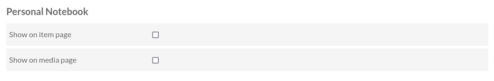
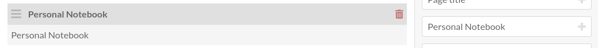

Usage
=====

Enable the module in site settings
----------------------------------

By default, the module doesn't allow taking notes anywhere. You have to enable
it in the site settings. You can enable it on item page, on media page, or
both.

If you are writing a theme and wants to include the widget somewhere else, you
can use the :code:`personalNotebook` view helper, like this:

.. highlight:: php

::

   <?php echo $view->personalNotebook()->form($itemOrMediaRepresentation); ?>

Add the block in a site page
----------------------------

The module adds a new type of site page block that the display the list of all
notes taken by the logged in user.
Add this block to a site page to allow users to see all their notes in one
place.

This block also allows users to delete their notes and to download them as a
CSV file.
